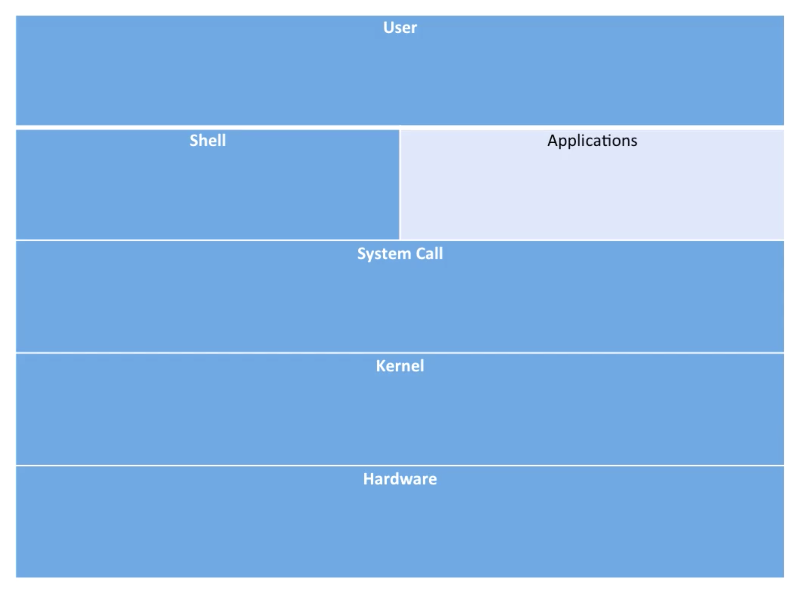
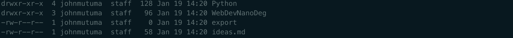

# Table of Contents
- [Contents of these notes](#contents-of-these-notes)
  - [Commands to cover](#commands-to-cover)
- [Introduction to shell scripting](#introduction-to-shell-scripting)
- [Shell configuration](#shell-configuration)
- [File system and directory hierarchy](#file-system-and-directory-hierarchy)
  - [Some default directories](#some-default-directories)
- [Multi-tasking and multi-user](#multi-tasking-and-multi-user)
- [ls-cd-man-exit-commands](#ls-cd-man-exit-commands)
- [mkdir rmdir rm cat and history commands](#mkdir-rmdir-rm-cat-and-history-commands)
- [cp mv inode](#cp-mv-inode)
- [who whoami tty which](#who-whoami-tty-which)
- [Calendar date and time commands](#calendar-date-and-time-commands)
- [vi editor](#vi-editor)
  - [Some commands](#some-commands)

# Contents of these notes
These notes will cover the following aspects;
- Introduction to shell and linux kernel
- Directory hierarchy in linux, a tree command demo
- Multi-tasking and Multi-user
- Linux system boot up and init-process

## Commands to cover
- ls, cd, ls -ltr, man
- cp, mv
- Softlink and Hardlink like `ln -s` and their differences
- tar, find, zip etc
- Wildcard pattern and regular expressions
- Environment variable
- PATH and LD_LIBRARY_PATH
- Absolute pathname and relative pathname, export command
- Creating profiles like .bash and .bash_profile
- which, date, cal, time
- mkdir, rmdir, rm
- cat, echo, who, whoami, tty, history
- stty, stty -a, stty -echo, some other tty variant commands
- Pipe (|) and redirection(>)
- Redirection to stdout, /dev/null, exec
- find command and xargs
- find file of a particular size or type and modified timestamps
- chown, chmod, Useradd, groupadd, groupdel
- sort, cut, uniq, less, head, tail
- awk, sed and grep
- ps, top, vmstat
- cat /proc/partitions /proc/cpuinfo /proc/meminfo
- telnet, ftp, ssh, selinux(Introduction)
- ACL and special file permissions like stick bit, setuid
- od, dd, bc, which, locate, passwd
- fg, bg, nohup, daemon, setuid
- uname -a, user level vs kernel level
- Kill and signal handler
- Script to trap a signal
- mount, unlimit, producing crash dump
- fdisk and gpart
- Mkfs, tunefs
- crontab
- log rotate
- Networking commands
  - Network setup
  - static vs dhcp IP address
  - Ifconfig
  - Route, netstat
  - Ping, ping6, traceroute
  - How to set up proxy in linux
  - Minicom setup
  - Run level
  - dmesg, log messages like /var/log/messages
  - Shutdown, reboot, sync, rsyslog
  - wget, curl
- Vi and search and replace
- Diff, sdiff, cmp
- Patch, and applying the patch
- Dos2unix and unix2dos
- Gzip, tar, cpio
- lzma, 7zip and bzip2
- Ubuntu, Fedora installation from Vmware
- Package manager
  - apt-get command in ubuntu
  - rpm commands in redhat
- Shell scripting
  - echo and variables
  - Environment variables
  - Export from within the Shell
  - if condition
  - if with or condition
  - if then elif else
  - case statements(switch)
  - Sleep
  - Argument passing
  - shift
  - Array declaration and processing in shell scripting
  - Basename, dirname
  - writing and calling functions in shell scripting
  - Test conditions like -le, -gt, -eq, = etc
  - expr and expression evaluation

# Introduction to shell scripting
A shell is a commandline utility which interacts with the kernel on the user's behalf. It is some kind of an interpreter; it interprets the user's input for the kernel to understand and also does command substitution e.g. `echo *`will not print out a `*`, but since `*` corresponds to a command(wildcard), it does that substitution.

Shells are mainly based on two broad categories;

- c-Shell categories; tcsh, csh
- Bourn Shell; sh, bash, ksh, pdsh

These notes will focus on the Bash Shell.

# Shell configuration
When a user logs into a system, a shell is invoked. The type of shell depends on the user's preferences in `/etc/passwd` which is being set by the system administrator during the time of account creation. We can find out the type of shell by running `echo $SHELL`.

*[img] Shell layer with respect to the operating system*

The kernel only interacts with the System call. The kernel is the heart of the operating system.

# File system and directory hierarchy
## Some default directories
- /bin - contains system binaries
- /home - contains user's home directory
- /dev - device files like block and character devices
- /etc - system configuration
- /lib - shared library and kernel modules
- /lib64 - 64-bit version of shared library
- /var - data that varies over time
- /sbin - binary utilities for which only root or system admin has access
- /mnt - mounting point for a file system
- /tmp - storing temporary data and files
- /proc - Kernel data structure mounted as filesystem. Only on Linux based OS
- /boot - contains initramfs and kernel image
- /sys - Kernel data structure for different hardware and device like Block Device, Firmware. Only on Linux

# Multi-tasking and multi-user
Multi tasking operating systems means that multiple processes can be run simultaneously. It is used when resources like memory and CPU are shared.

Multi-user implies that different users can log in simultaneously on a remote terminal or ssh or Telnet(unsecured plaintext Protocol) and they can each run their own copy of the same programs(or different) without interfering with each other. The user accounts are built up in such a way that no user can interfere with another user's files, processes and resources except when they belong to the same group and adequate permissions are granted.

# ls-cd-man-exit-commands
## ls command
The ls command lists the directories and files in the current working directory. We can issue `ls` on the command. We can pass options to the command e.g. `-l`, long listing, to produce the detailed list;

*[img] output for `ls -l`*

As we can see, the first row in the screenshot contains type and permission information of the item. The value begins with either `d`, for directories, or `-` for files. It is then succeeded by 9 characters representing permission information. The first three are the user's permission, the middle three are the user group's permissions and the last three are the permissions of other users. `r` - read, `w` - write, `x` - execute.

The second column indicates the number of links. i.e. how many files and directories does the link contain?

The third column is for the owner of the file. The fourth column is for the group of the owner.

The fifth column is the size of the file.

The sixth column is the time details of the file's creation.

We can also issue `ls -l` with the `h`, human readable, option, `ls -lh` to see the outputs especially size in a human readable format e.g. `4.5K` instead of `4500` in the size column.

## cd command
Changes the present working directory.

## man command
This gives a manual for a specified command e.g. `man ls`.

## exit command
Exits the terminal.

# mkdir rmdir rm cat and history commands
## The cat command
Used for peeping into the contents of a file and also creating a file.

We can create a file with the `cat` command; `cat > abc.txt`. This opens an input stream into which we can write content to be put into the file once we signal `end of input` with `CTRL+D`. The contents that we provided will be put into a the file named `abc.txt`.

Without the redirection (`>`), i.e. `cat abc.txt`, the command will display the contents of `abc.txt`.

It can also be used to concatenate two files. e.g. `abc.txt` and `abc1.txt`.

> cat abc.txt abc1.txt > new-file.txt

This will put the contents of both files into `new-file.txt`.

## The rm command
This is used for unlinking i.e. deleting a file.
> rm abc.txt

`rm` in its raw form can't remove directories; we need to specify some options to remove a directory with the `rm` command. These are `-rf`; `r` - recursive, `f` - force.

## The mkdir command
This creates a new directory
> mkdir bash-tut

## The rmdir command
This is used to remove the a directory like `rm -rf` but it only deletes a directory if it is not empty.
> rmdir bash-tut

## The history command
This shows the history of commands issued on a terminal.

# cp mv inode
## The cp command
Used to copying a file or directory.
> cp test.txt test_copy.txt

This creates a copy and not a reference of the source file. You can check to confirm that the inodes(blocks of memory) for the two files are different with;
> ls -li

When trying to copy a directory, the command above will not be successful. Just like the `rm` command, we need to issue the command recursively;
> cp -r my-dir my-copy-dir

## The mv command
Used for moving a file or directory and it's also used for renaming.
> mv my-file.txt my-new-file-name.txt

The mv command doesn't create a different copy of the original file, it only changes its access path in the directory tree, but in hard drive memory, the file remains at the same place, only its directory path changes. We can confirm that it is the same file with a different name by comparing the `inode` values from `ls -li` before and after the move. These should be the same. The same behaviour applies with directories.

To prevent overwriting other files, we can issue the command in interactive mode;
> mv -i file file2

# who whoami tty which
- The who command; used for finding out who is logged into the system currently
- The whoami command; this tells which user is running the terminal
- The tty command; this tells the terminal type
- The which command; tells the source of the command i.e. from where the command is running. e.g. `which tty` which would produce `/usr/bin/tty`. It locates the commands binary, the file that gets executed

# Calendar date and time commands
- The cal command; this, without any options and/or arguments displays the calendar current month on the terminal. We can issue the year numnber e.g. `cal 1988` to get that year's calendar. In order to produce a month for a particular year, we can pass the month number in the command e.g. `cal 08 2017` to produce calendar for August 2017
- The date command; this produces the current date and outputs on the terminal. We can pass a format for which the date should produced with `+<format>` e.g. `+%H:%M:%S` which is equivalent to `+%T`. Check `man date` for format and more options. The date command can also be used to set the system date. This is done by issuing the command with some date and time value in the format `%m%d%H%M%Y.%S` e.g. `date 092721002019.30` will set the system date to `09 Sep 2019 21:00:30`
- The time command; this is not used to display the current time. It is used to display information with regards to how long a command takes to execute e.g. `time ls`, `time node index.js` etc.

# vi editor
The vi editor runs in edit mode and command mode.

The edit mode allows us to input text into the open file where as the command mode allows us to issue commands to the editor with regards to manipulating the contents of the file.

## Some commands
- `o` (open) - hitting the letter `o` in command mode adds a new line below the current location of the cursor and opens the edit mode in place
- `dd` (delete) - deletes the line in which the cursor currently stands. You can preceed it with a number to specify a count of lines to delete. e.g. `3dd` to delete three lines
- `dw` (delete word) - deletes the characters to the right of the cursor upto and inclusive of the first white space character. Similarly, `3dw` deletes 3 words and so forth
- `x` - deletes one character at a time to the right of the cursor, and if there's no character to the right, it deletes the one to the left of the cursor
- `yy` (yank) - this copies the line at the current location of the cursor
- `p` - this pastes the line in the clipboard. It can be preceeded by the yanking command above to achieve the copy-and-paste effect
- `u` (undo/revert) - undos the most current changes
- `:set nu` - in command mode hitting `:` and typing the command `set nu` displays the line numbers. These can be hidden by hitting `:` then issuing the command `set nonu`
