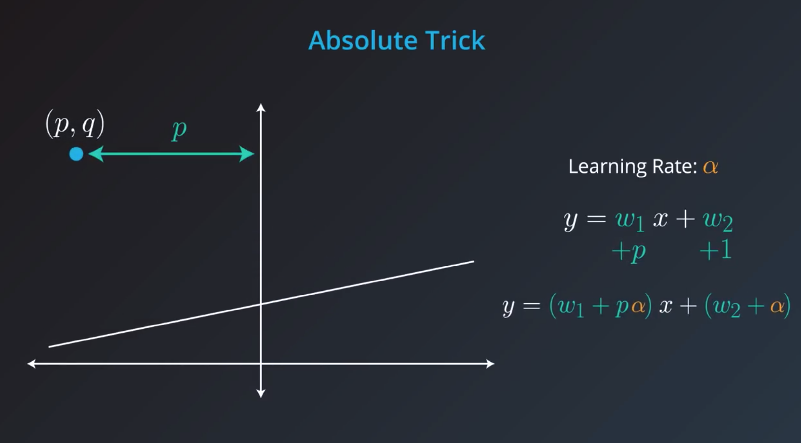
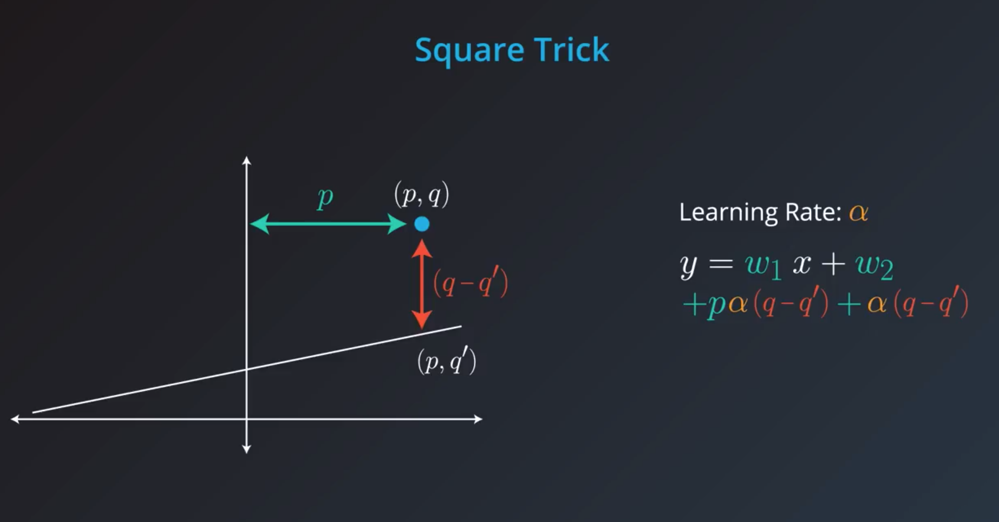
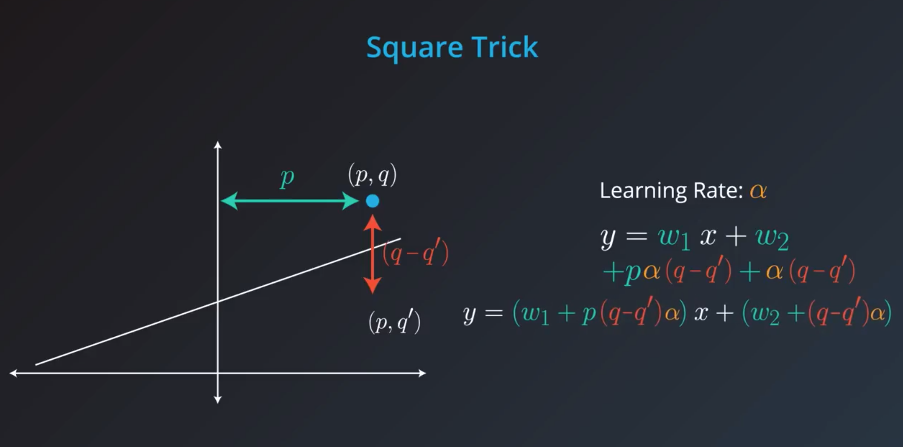

These notes will focus on Data science and Machine Learning and less on Statistics introductory knowledge. Please checkout the `Introduction to Data Science` notes for statistical know-how.

# Table of Contents
- [A birds overview of machine learning](#a-birds-overview-of-machine-learning)
  - [Types of machine learning](#types-of-machine-learning)
  - [Deep learning and neural networks](#deep-learning-and-neural-networks)
- [Linear regression](#linear-regression)

# A birds overview of machine learning
## Types of machine learning
Machine learning has three main categories;
- Supervised learning
  - Classification - categorical outcomes
  - Regression - numeric outcomes
- Unsupervised learning
- Reinforcement learning

## Deep learning and neural networks
Deep learning has beaten essentially all other machine learning algorithms in its ability to predict and it can be used for supervised, unsupervised and reinforcement learning.

The barriers to deep learning include;
- A lot of data is required
- It requires high computing power
- Complex algorithms involved

We'll see some aspects of deep learning; however, it is not the primary focus of these notes.

# Linear regression
It is one of the most fundamental algorithms in machine learning. We'll see how it works in this section.

Linear regression involves determining the expression for the line of best fit and using that to make predictions.

## The absolute trick
This is a concept used in moving the fitting line closer to a point. Taking an example of a point at `(x, y)` and a starting fitting line at `y = ax + b`, we add `learning_rate•(x)` to the gradient of the line `(a)` and `learning_rate•(1)`. e.g. if the learning rate is `0.1` the new gradient of the fitting line becomes, `a + (0.1 * x)` and the new `y-intercept` becomes `b +( 0.1 * 1)`.

## The square trick
This is an improvement to the absolute trick above. It introduces the vertical distance of the point in question from the initial fitting line. We factor the vertical distance in our calculation for the new gradient and y-intercept.

[img] Line before transform

[img] Line after transform
