# Table of Contents
- [Introduction](#introduction)
- [Using data to think about the future](#using-data-to-think-about-the-future)
  - [Predictive analytics](#predictive-analytics)
  - [Traditional data science methods in analytics](#traditional-data-science-methods-in-analytics)
  - [Machine Learning data science methods in analytics](#machine-learning-data-science-methods-in-analytics)
    - [Types of machine learning](#types-of-machine-learning)
    - [Techniques used](#techniques-used)
- [Popular data Science tools](#popular-data-science-tools)
- [Characteristics of data (5Vs)](#characteristics-of-data-5vs)
- [Statistics](#statistics)
  - [Population and Sample](#population-and-sample)
  - [Descriptive Statistics](#descriptive-statistics)
    - [Classification of Data](#classification-of-data)
      - [Based on type](#based-on-type)
      - [Based on levels of measurement](#based-on-levels-of-measurement)
    - [Visualising data](#visualising-data)
      - [Categorical(Nominal and Ordinal) variables visualisation techniques](#categoricalnominal-and-ordinal-variables-visualisation-techniques)
      - [Numeric(Ratios and Intervals) variables visualisation techniques](#numericratios-and-intervals-variables-visualisation-techniques)
    - [Measures of central tendency](#measures-of-central-tendency)
      - [The mean](#the-mean)
      - [The mode](#the-mode)
      - [The median](#the-median)
    - [Measures of Asymmetry](#measures-of-asymmetry)
      - [Skewness](#skewness)
    - [Measures of variability](#measures-of-variability)
      - [Univariate measures](#univariate-measures)
        - [Variance](#variance)
        - [The standard deviation](#the-standard-deviation)
        - [Coefficient of variation](#coefficient-of-variation)
      - [Multivariate measures](#multivariate-measures)
        - [Covariance](#covariance)
        - [Correlation coefficient](#correlation-coefficient)
  - [Inferential statistics](#inferential-statistics)
    - [Distributions](#distributions)
      - [The normal distribution](#the-normal-distribution)
        - [Standardising the normal distribution](#standardising-the-normal-distribution)
        - [The central limit theorem](#the-central-limit-theorem)
        - [The standard error](#the-standard-error)
        - [Confidence intervals](#confidence-intervals)
          - [Determining a confidence interval](#determining-a-confidence-interval)
      - [The student's T distribution](#the-students-t-distribution)
        - [Confidence intervals with population variance unknown](#confidence-intervals-with-population-variance-unknown)
  - [Hypothesis Testing](#hypothesis-testing)
    - [Rejection region and significance levels](#rejection-region-and-significance-levels)
    - [Errors in hypothesis testing](#errors-in-hypothesis-testing)
      - [Type I error](#type-i-error)
      - [Type II error](#type-ii-error)
    - [Test for mean](#test-for-mean)
      - [Population variance known](#population-variance-known)
  - [Advanced Statistical Methods](#advanced-statistical-methods)
      - [Linear Regression](#linear-regression)
      - [The R Squared Measure](#the-r-squared-measure)
      - [Using seaborn for visualisations](#using-seaborn-for-visualisations)
      - [Decomposition of variability](#decomposition-of-variability)
      - [Multiple Regresssion](#multiple-regresssion)
      - [Test for overall significance of the model - F test](#test-for-overall-significance-of-the-model---f-test)
      - [The Assumptions of the OLS](#the-assumptions-of-the-ols)


# Introduction
## Techniques for working with traditional data
Data is a very broad term and can be used to refer to:
- raw facts
- processed data
- information

Raw data requires processing because it cannot be analysed straight away. **Data Preprocessing** is an important step in transforming data into more understandable and analysable format. It may come before the actual data processing. e.g. correcting invalid values like a name in an age column.

### Techniques used in preprocessing raw traditional data
- class labelling - categorical vs numerical
- data cleansing/data cleaning/data scrubbing -
  Dealing with inconsistencies such as misspellings
- dealing with missing values

### Visualisations associated with Relational Database Management Systems
- [Entity Relationship diagrams](https://www.lucidchart.com/pages/er-diagrams) - these are also referred to as ER diagrams
- [Relational Schema]()


## Techniques for working with big data
Big data includes a wider range of data types besides numerical and categorical. We can also have digital types like text, audio, video, images etc.

### Techniques used in preprocessing raw big data
- text data mining
- data masking - preserve confidential information

## Business intelligence techniques
This is the stage that comes after raw data has been collected, processed and pre-processed. The stage answers business questions from data. e.g. which region did we make the most sales? How well did we perform this year in comparison to last year?

Some techniques:
- Quantification of observations
- Accumulation/aggregation of observations

Business intelligence involves extracting information from data and presenting it in the form of:
- metrics
- KPIs
- reports
- dashboards

BI can be useful for instance in:
- Price optimisation - varying prices with demand
- Inventory management


# Using data to think about the future
This is the life after business intelligence has been conducted and dashboards and reports generated and we have good understanding of the past. We then need to leverage the data and the information gathered in order to make some predictive decisions from the data.

## Predictive analytics
These comprise classical statistical methods for forecasting and machine learning.

### Traditional data science methods in analytics
#### Techniques used
- Regression - model for quantifying causal relationships between variables in a dataset
  *In a visualisation, a regression line goes straight through the observation points while being as close as it can be to each observation point.* It represents a linear econometric relationship between the variables.

- Logistic regression - this is a non linear model of regression; the values on one of the variables are binary categorical; 0s or 1s. They are useful for decision making process.

- Cluster analysis - different groups in the observations exhibit similar relationships
- Factor analysis - while clustering involves grouping observations together, factoring involves grouping explanatory variables that seem alike together. e.g.

  Question 1: Do you like animals?

  Question 2: Do you discourage cruelty against animals?

  The two questions can be made into one;

  What is your general attitude towards  animals?

- Time series - good for forecasting


### Machine Learning data science methods in analytics
Involves creating an algorithm that a computer uses to find a model that fits data as best as possible and uses it to make accurate predictions.

#### What is a machine learning algorithm?
In plain terms, it is like a trial-and-error process where each consecutive trial is at least as good as the previous one. There are four ingredients:

- Data
- Model
- Objective function
- Optimisation algorithm

When training, the machine is given a goal and not a set of rules!
The learning can be stopped once the machine hits a certain level of accuracy.


#### Types of machine learning
- Supervised learning - involves labelled data
- Unsupervised learning - involves unlabelled data
- Reinforcement learning - introduces a 'reward system'

#### Techniques used
##### Supervised learning
- Support vector machines
- Neural Networks
- Bayesian Networks
- Random forest models
- Deep learning

##### Unsupervised learning
- K-means
- Deep learning

*NB:* Deep learning appears in both types of ML. It's a new revolutionary type of computation(the state-of-the-art ML).

Deep learning has a broad practical scope of application because of the high accuracy of it's models.

##### Reinforcement learning
Similar to unsupervised learning but instead of minimising loss, one maximises reward.

# Popular data Science tools
## Programming languages
R and Python are very popular.
Matlab, Scala and SQL also vastly used. Java, JavaScript, C/C++ are also common in ML.

R and Python are very popular because;
- they are very suitable for mathematical and statistical computations
- they are adaptable

Matlab is ideal for working with mathematical functions or matrix manipulations. Matlab is a paid service; Octave is a good free alternative.

Java and Scala are not designed for doing computations but they prove to be very good when combining data from multiple sources.

## Software
Some software common in Data science;
- Traditional - Excel, SPSS
- Big data - Hadoop(more like a software framework), MongoDB, ApacheHBASE
- BI - PowerBI, Tableau, Qlik, SaS
- ML - Microsoft Azure, AWS, rapid miner

# Characteristics of data (5Vs)
- Volume - size of the data
- Variety - of data types involved
- Velocity - with which it is processed
- Veracity - is it's truthfulness and conformity to facts
- Variability - of sources it has been retrieved from


# Statistics

## Population and Sample
Population - collection of all items of interest to the study `N`. Numbers obtained from a population are called parameters.

Sample - a subset of the population used for a study. `n`. Numbers obtained from a sample are called statistics. A sample must be random(chosen strictly by chance) and representative (accurately reflects the members of the entire population) for an insight to be precise.

## Descriptive statistics
### Classification of data
Data can be classified based on its types and its measurement levels.

#### Based on type
- Categorical - categories or groups e.g. seasons, colour. They are not numbers and cannot be ordered against each observation by magnitude
- Numerical - these can be ordered by their magnitude
  - Discrete - can be counted in a finite manner e.g. no. of children, no. of cars etc.. They can only be represented as integers
  - Continuous - Infinite and impossible to count. Can vary by incomprehensibly small amounts e.g. weight, height, area, distance, time etc.. They can be represented as floating point values


#### Based on levels of measurement
- Qualitative
  - Nominal - akin to categorical data
  - Ordinal - akin to categorical except that they can follow an order of magnitude e.g. low-medium-high, cold-warm-hot,
- Quantitative
  - Ratios - they have true zeros
  - Intervals - they have no true zeros and the distances between any two adjacent points have equal magnitude e.g. temperature(degrees and farenheights)


###  Visualising data
It is very easy to decide on which type of visualisation is most appropriate based on the classification of data by type and/or levels of measurement.

#### Categorical(Nominal and Ordinal) variables visualisation techniques
These are best visualised with:
- Frequency Distribution tables. See example [below](#frequency-distribution-table-example)
- Bar Charts
- Pie Charts
- Pareto diagrams - a pareto diagram is simply a bar chart with the items ordered by their relative frequency and also includes a additional line representing the cumulative frequencies; this is plotted against an additional axis for the frequency line. It can be used to display information that bar graphs would normaly do and additionally shows the cumulative frequencies e.g. top 1, top 2 etc. if ordered in descending order and bottom 1, bottom 2 etc if ordered in ascending order.

#### Numeric(Ratios and Intervals) variables visualisation techniques

- Histogram: when visualising Numeric data on a Histogram, it only makes sense when we group the items into ranges. It is recommended that we use 5 to 20 number of ranges. The interval width can be computed as follows. It is useful when visualising data asymmetry:
  ```
  number of intervals = (max_value - min_value)/diserable_no_of_intervals
  ```
  it is more common to plot a Histogram with the relative frequencies rather than the absolute frequencies
- Frequency Distribution Table/Graph - this is well applicable if the numeric data is discrete. Unlike the Histogram, this doesn't bundle data together into ranges and some information like the `mode` of the data can be seen
- Cross Tables:
- Scatter plots:

### Measures of central tendency
#### The mean
This is also known as the simple average. The mean is a very common measure but one of its downsides is that it is easily affected by outliers.

#### The median
This is computed by getting the middle point in an ordered dataset (or an average if the middle point is between two elements in the dataset). It is not affected by outliers giving a less biased representation.

#### The mode
The number that occurs most often. Can be used both for categorical and numerical data.

There is no best measure of central tendency amongst the three but the best practice is to use at least two of them together and the worst practice is to use only one.

### Measures of Asymmetry
#### Skewness
This is a measure of asymmetry that indicates whether the observations in a dataset are skewed on one side.
A quick glance at the measures of central tendency can suggest the type of skewness; if the mean of a dataset is greater than the median, then we have a `positive` or a `right` skew. They are skewed to the right because the outliers are to the right of mean. **By plotting a Histogram on such a dataset, we can see that the outliers are to the right.**

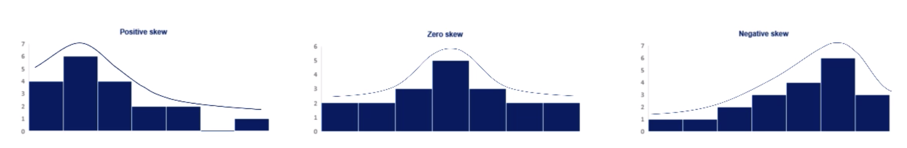
*[img] Types of skewness in data*

Measures of symmetry such as skewness are the link between measures of central tendency and probability theory which contributes a lot towards understanding the data that we're working with.

### Measures of variability
There are univariate and multivariate measures of variability. The following are the univariate measures;

#### Univariate measures
##### Variance
Measures the dispersion of a set of data points around their mean value.

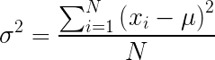

*[img] Population variance*


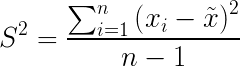

*[img] Sample variance*

The variance is also referred to as the `Mean Square Deviation`.
Ideally, the numerator is amplified to the second degree(squared) in order to;
- eliminate the effect of cancelling out negative and positive values when summing
- to amplify the magnitude of large differences

The population variance has a higher potential variability because more data points are available; that is why the denominator in the sample variance is less 1 in order to rightfully correct the sample variance upwards.

##### The standard deviation
In most cases, the value obtained from the variance is huge and hard to compare as the units of measurement are squared. The easy fix is to get the Standard Deviation of the data; this is the square root of the variance. It is also called the `Root Mean Square Deviation`.

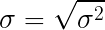

*[img] Population standard deviation*

The same is for the sample standard deviation.

##### Coefficient of variation
This is also called the `Relative standard deviation`. It is the fraction of the standard deviation and the mean. i.e. The standard deviation divided by the mean.

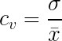

*[img] Population relative standard deviation* 👆🏽

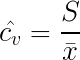

*[img] Sample relative standard deviation*

This is perfect for comparing variance between different data.


#### Multivariate measures
The are two major **Accumulation** measures of variability and these are;

##### Covariance
This is a measure of correlation between two variables. It answers the question with regards to how correlated two variables are in a dataset. Unlike variance, it can either be positive, negative or zero.

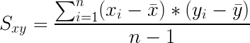
*[img] Sample Covariance*

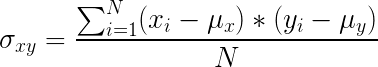
*[img] Population Covariance*

Computing the value results a measure that is not very easy to compare with another because the values that result are completely of different scales. They have no perceivable relationships. The correlation coefficient helps in solving that problem

##### Correlation coefficient
Correlation adjusts covariance so that the relationship between the two variables becomes intuitive and easy to understand and interpret. It can be described as the ratio between the covariance and the product of the standard deviations of the two variables.

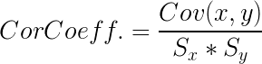
*[img] Correlation coefficient*

The value can range between -1 and 1 with the former indicating perfect negative correlation between the two variables at all and the latter being an indication of perfect positive correlation. A coefficient of 0 is an indication of lack of correlation between the two variables.

It is also important to understand the direction of causal relationships. For now, we should understand that correlation does not imply causation.

### Further notes
You may find more notes on the topic of descriptive statistics [here](resources/descriptive_statistics.pdf)

### Exercise
You may want to checkout the suggested assignment [here](resources/real_estate_data.xlsx) for practise.


## Inferential statistics
Inferential statistics refers to statistical methods that rely on the Probability Theory and Distributions, in particular, to predict population values from sample data.

### Distributions
A distribution is a function that shows the possible values for a variable and how often they occur.

e.g. The Discrete Uniform Distribution where each element has an equal chance of occurring.

There are various types of distributions including; binomial, poisson, geometric, normal, discrete uniform, etc. These notes will concentrate on the Normal and Student's T distributions due to the following reasons;

- They approximate a wide variety of random variables
- Distribution of sample means with large enough sample sizes could be approximated to normal
- All computable statistics are elegant
- Decisions based on normal distribution insights have a good track record

More on these as we proceed.

#### The normal distribution
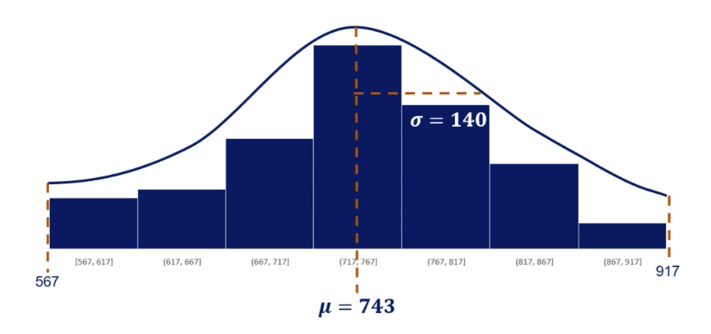
*[img] A simple normal distribution*

It can be expressed as;

[normal_dist_expr]: notes-images/normal_dist_expr.png
![][normal_dist_expr]

The statistical term for this is the Gaussian Distribution and most people also refer to it as the `bell curve` due to its shape.

It is symmetrical and its mean, median and mode are equal. It has no skew and it's perfectly centered around its mean. The standard deviation, at 140, determines the spread of the curve.

##### Standardising the normal distribution
Standardising a variable involves transforming it its values into values that will have a mean of zero and a standard deviation of 1.

It involves mapping from;

![][normal_dist_expr]

to;  

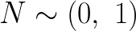

To do that we standardise every observation of the variable using the mean and the standard deviation. The result for each observation is what is referred to as a `z-score`. The following formula allows us to standardise the observations of normal distribution variable;

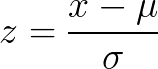

The resultant values are a standardised normal distribution of the values of the variable at hand. We'll see how using a standardised normal distribution of a variable makes predictions easier for us.

##### The central limit theorem
This implies that regardless of the distribution of a dataset, the distribution of the mean, gotten by picking several samples from the dataset, tends to be a normal distribution. The mean of the samples means tend to equal the original mean and the variance tends to equal the original variance divided by the sample size.

The sampling distribution can be expressed as follows;

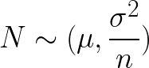

##### The standard error
The standard error is the standard deviation of the distribution of sample means. i.e. the standard deviation of the sampling distribution.

With the expression of the sampling distribution above, we can therefore express the standard error as follows;

[stderr]: notes-images/standard-error.png

![][stderr]


i.e. the square root of the variance of the distribution. It shows the variability of the means of the different samples we have extracted from a population.

This is a very important measure as it shows how well the true mean was approximated. It decreases as the sample size increases.

##### Confidence intervals
This refers to the range in which we'd expect a population parameter to fall within with a certain percentage level of confidence.


###### Determining a confidence interval
This can be computed in two ways;
- When either the population variance or standard deviation is known
- When either the population variance or standard deviation is unknown

When the population variance is known;

We can compute the confidence interval by taking the sample mean and accounting for the standard error factored with an element of confidence. i.e. the standard error multiplied by a confidence factor which can be gotten from the table of `z-scores`.

We begin by choosing a confidence level with which we'd state our results. Common confindence levels are 90%, 95% and 99%; i.e. .90, .95, .99 with corresponding alpha values of .10, .05 and .01 respectively. We can get the confidence factor, i.e. z-score, for a confidence level by looking for the area under the curve that is equal to; `(CL/100) + (alpha/2)` or `1-(alpha/2)` e.g. for a Confidence Level of 95%, get the z value that corresponds to `1 - (.05/2) = .975`. This results to a z value `1.96`. With that in mind, we can compute the confidence interval with the following expression;

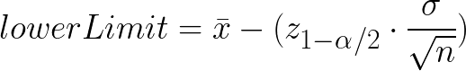
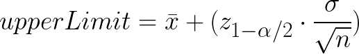

**An example;**

Consider we would like to find a confidence interval for the salaries of Data Scientists in region. We happen to be aware that the standard deviation of the population is `$15,000`. We take 30 samples and determine their individual means. Calculate the mean of those samples means and it results to `$100,200`. Let us determine at a confidence level of 95% what the average salary would be.

*Solution:*

The confidence factor(z-value):

Reading from the table of z-scores, the value that corresponds to `1 - (.05/2) = .975` is `1.96`

The standard error. i.e. the standard deviation of the samples' means; ![][stderr]

We compute the standard error as `15000 / sqrt(30)` = `2,739`.

We can go ahead and compute the upper limit;

lower limit = `100,200 - (1.96 * 2739)` = `$94,833`;

upper limit = `100,200 + (1.96 * 2739)` = `$105,568`;

*Conclusion*

With these results, we can make a conclusion that with a confidence level of 95%, the average salary of Data Scientists is going to fall between `$94,833` and `$105,568`.

#### The student's T distribution
This is a distribution that was introduced by a statistical researcher William Gosset, as Student, while working for the brewery of Guinness; to find the best yeilding varieties of berly. He found big samples tedious and he wanted to find ways of extracting small samples and yet come up with meaningful and reliable findings.

Ronald Fischer introduced William Gosset's T Statistic.

It is one of the biggest breakthroughs in statistics as it allowed;
- inference into small samples
- unknown population variance

Visually, it looks much like a normal distribution, but have fatter tails. Fatter tails allow for a higher dispersion of variables and there's more uncertainy.

As we have the `z-statistic` for normal distribution, the `t-statistic` corresponds to the T Distribution. It's expression is also quite similar to that of the `z-statistic`;

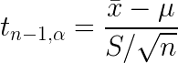

This can be read as the `t` value for `n-1` degrees of freedom and a significance level of `alpha`. The degrees of freedom are usually the sample size less one, ` n-1`.

Much like the normal distribution's table of `z-scores`, we also have the `t-table`.


##### Confidence intervals with population variance unknown
Even with an unkwown population variance, we can still make predictions.

Let's consider an example similar to the previous Data Scientists salaries;

**Example**

Consider that we take nine different samples from a population and find find their means. If on computing the means of these means we get a value of `$92,533`. We head on to calculate the Standard Deviation of the means and we get a value of `$13,932`.

From that information, we can compote the standard error of the sampling distribution, and choose a Confidence Interval Level that will yield a `t` statistic from the `t-table`.

Let us choose a common Confidence Interval Level of 95% like we used in the previous example and compare the results.

**Solution**

From the `t` formulae, we can deduce the confidence interval formulae as follows;

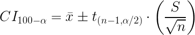

Notice how this is similar to the Confidence Interval for the know population variance with `z` scores; we have substituted the population standard error for the sample standard error and the `z` statistic for the `t` statistic.

From the t-table, we can read the value that corresponds to `n-1` = 8 degrees of freedom and significance level of `(100-95) / 2` = 2.5% = 0.025. This yields a value of 2.32. Let's go ahead and findthe standard error for the sampling distribution with the formulae. This yields `13,932 / sqrt(9)` = 4,644.

|item                   | value          |
|:----------------------|:--------------:|
|sample mean            | 92,533         |
|sample std error       | 4,644          |
|t-value CI(95%) 8d.f   | 2.32           |

Lower limit = `92533 - (2.32 * 4,644) = 81,806`

Upper limit = `92533 + (2.32 * 4,644) = 103,261`

**Conclusion**

The Data Scientists salary is expected to be in the range of `$81,806` and `$103,261` at 8d.f and a confidence level of 95%.

As we can observe, the width of the second range outcome is much broader than when we had a known population variance. Two factors majorly contribute to this effect;
- The sample size is much smaller at size 9
- The population variance is not known at all

With these, we rightfully do expect higher levels of uncertainy, leading to a broader confidence interval range.

_You may want to check out [this dataset](resources/confidence-intervals-exercise.xlsx) on shoe sales for a little exploration with confidence intervals._

_Check out more notes on inferential statistics [here](resources/inferential-statistics.pdf)._

## Hypothesis testing
A hypothesis is basically an idea that can be tested.

In hypothesis testing, we have the Null Hypothesis (H0) and the Alternative Hypothesis(H1). The Null Hypothesis is the postulation to be tested and the alternative hypothesis is everything else. e.g. If a statement is 'The average salary of a Data Scientist is $113,000'. The null hypothesis is that that is true and the alternative hypothesis is that it is false.

We would run a test to determine if the expected population mean is close enough to the postulated value, and if so, we can accept the null hypothesis or otherwise.

The null hypothesis is the statement we're trying to reject and the alternative hypothesis is the personal opinion that can be proved.

### Rejection region and significance levels
The significance level is the probability of rejecting the null hypothesis when it is true. It is denoted by `alpha`. It is a value that you select based on the certainty you need. Typical values are usually, .01, .05 and .1.

Hypothesis testing usually follows the following three broad steps;

- Calculate the statistic e.g. the mean
- Scale (Standardise) it with e.g. the z-score
- Check if the z-score is within the rejection area or not

### Errors in hypothesis testing
There are Type I and Type II errors in hypothesis testing.

#### Type I error
This is when we reject a true null hypothesis. It is also called a false positive.

### Type II error
This occurs when we accept a false null hypothesis. It also called a false negative.

### Test for mean
#### Population variance known
We can compute the standardised value and look up from the `z-table` for comparison.

To do a hypothesis testing on the postulation that the average salary of a Data Scientist is 113,000, we proceed by computing the sample mean standardising the postulated mean based on that. The z- value obtained is then compared by the z-value of the significance level; keeping in mind that this is a two tailed test, we can use `(significance level) ÷ 2`.

#### The p value
The p value is the smallest significance level at which we can still reject the null hypothesis, given the observed sample statistic. If the chosen significance level is more than the p-value, then we can reject the null hypothesis.

We can look up the Z-area that corresponds to the z-score(critical value). The p value is a universal concept that works for all distributions.

You can find some more notes on Hypothesis testing [here](resources/hypothesis_testing.pdf)

## Advanced Statistical Methods
### Linear Regression
Linear regressions is a linear approximation of the causal relationship between two or more variables.

Some important packages when using Python for Data Science include;
- numpy - this allows us to work with multidimensional arrays
- pandas - enhances numpy even more allowing us to organise data in a tabular form and attach descriptive labels to the rows and columns
- scipy - a Python ecosystem containing a wide variety of tools for scientific computations. It includes tools for mathemaitcs, machine learning,  engineering and more
- statsmodels.api - helpful for producing nice statistical summaries
- matplotlib - 2D visualization library specially designed for visualisation of numpy computations
- seaborn - Python visualisation library based on matplotlib. It provides a high level interface for producing attractive statistical graphics
- sklearn - a widely used machine learning library

### Decomposition of variability
Variability in the dependent variable can be broken down into three after fitting a regression model.

- `The Sum of Squares Regression` - 
  This is a measure of variability explained by the regression model. It can be expressed as follows;
  
  $$
    SSR = {
      \sum_{i=0}^{n} (\widehat{y_i} - \bar{y})^2
    }
  $$

- `The Sum of Squares Error` - 
  This is a measure of varibalility that is unexplained by the regression model. It is a measure of variablity caused by other factors that are not in the model. It can be expressed as follows;
  $$
    SSE = {
       \sum_{i=0}^{n} (y_i - \widehat{y_i})^2
    }
  $$

- `The Sum of Squares Total` - 
  This is a measure of the total variability. It is the sum of `SSR` and `SSE`. It can be expressed as follows;
  $$
    SST = {
       \sum_{i=0}^{n} (y_i - \bar{y_i})^2
    }
  $$

[decomposing-variability]: notes-images/decomposing-variability.png
![][decomposing-variability]


### The R Squared Measure
Once we have produced a regrression model, we need to know how much good a fit it is for the data in question. R Squared is a good measure for the goodness of fit. It show the proportion of variability in the data that is explained by the regression model. It is computed as proportion of the variability explained by the model and the total variability of the data. 

$$
  R^2 = \frac
            {Sum \: Squares \: Regression}
            {Total \: Sum \: Squares}
$$

### Using seaborn for visualisations
In order to take advantage of `seaborns` visualization aesthetics, we need to import it. Then set it so as to override default matplotlib visualization style as follows;

```python
import seaborn as sns

sns.set()
```

### Multiple Regresssion
In real life a dependent variable is not usually solely dependent on one factor. There are more factors that influence the variability of the variable's value. The more factors we introduce into our regression models, the better the fit becomes. i.e. $ R^2 $ becomes much better.

This has a downside when we add factors into the models that don't really have significance in the variability of the dependent variable. We can be able to point such variables out by observing the `Adjusted R - Squared` value and comparing that with its value before the additional variable was factored. Furtheremore, insignificant varibales have a very high p- value as can be observed from the summary produced by the `statsmodels`. The null hypothesis for a regression model on each variable is the the coefficient for that variable is 0. $ H_0: \beta = 0 $

### Test for overall significance of the model - F test
The F test attempts to determine the general significance of the model. The null hypothesis of the F test is

$$ H_0: \beta_{1} \: = \: \beta_{2} \dots \beta_{k} \: = \: 0  $$

It allows us also to compare models.

### The Assumptions of the OLS
#### Linearity
OLS assumes that the model is linear. Each explanatory variable has a coefficient and there's a common constant value. We can determine if a linear model would be suitable by looking at the scatter plot between a dependent and an independent variable and judging if we can observe any visual linear trend. If the observation is not linear, we should not use the data before transforming it appropriately e.g. exponential or logarithmic transformation.

#### No Endogeneity
This refers to a situation whereby an explanatory variable is correlated with the error term. This is usually a result of omitted variables. When a we have a variable, Z, that is not included as an x variable yet it it is correlated to one of the x variables and the y variable, then that means that the x variable is correlated with the error term as the error term includes all other factors that are not accounted for in the model.

#### Normality and Homoscedasticity
This makes an assumption that the error term is normally distributed. It also expects that the error term will have a zero mean. Homoscedasticity implies equal variance of the error terms for different observations with the same model. This can be prevented by;

- Looking for the omitted variable bias
- Looking for outliers
- The log transform

#### No Autocorrelation
This is also known as no serial correlation. This autocorrelation is on the error terms. The remedy is to avoid using a linear model when the error terms are autocorrelated. The Durbin Watson statistic is a good measure for autocorrelation.

#### No Multi-collinearity
We observe multi-collinearity when two or more variables have a high correlation.


## Appendix
#### Frequency Distribution Table example
|   |Freq  |
|:-:|:-----|
|A  |20%   |
|B  |30%   |
|C  |50%   |
|**Total**|**100%**|
