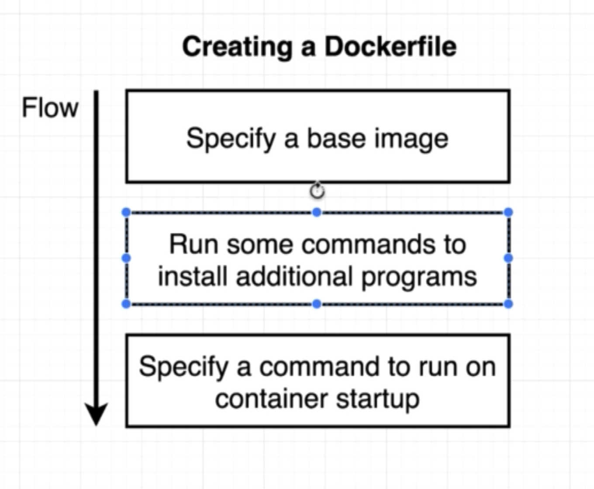

# Table of Contents
- [Why Use Docker](#why-use-docker)
- [Using the Docker Client](#using-the-docker-client)
- [What is an Image](#what-is-an-image)
- [Manipulating Containers with the Docker Client](#manipulating-containers-with-the-docker-client)
  - [Overwriting default command](#overwriting-default-command)
  - [Listing containers](#listing-containers)
  - [Restarting stopped containers](#restarting-stopped-containers)
  - [Removing stopped containers](#removing-stopped-containers)
  - [Stopping running containers](#stopping-running-containers)
  - [Executing commands in running containers](#executing-commands-in-running-containers)
    - [The purpose of the -it flag](#the-purpose-of-the--it-flag)
- [Creating docker images](#creating-docker-images)
- [Appendix](#Appendix)

# Why Use Docker
Docker makes it very easy to install and run software without worrying about errors and dependencies.

# Using the Docker Client
To run a command with docker, we use `docker <command> [options]`
e.g. `docker run hello-world`. When this command is run, a series of steps occurs as follows:

- The docker client contacts the docker server
- The docker server attempts to locate the image `hello-world` from the image cache on the local computer
- The docker server on finding no such image locally contacts the docker hub to look for a container with that name and downloads it
- The docker server then runs the image creating as container with the image

## What is an Image
A docker image is basically a File System snapshot that is run to create containers. It includes installed software and dependencies and needed files. It also includes a start up command for the container.

## Manipulating Containers with the Docker Client
### Overwriting default command
With `docker run`, we can supply our custom command to overwrite the defalut command for the container e.g. `docker run <image> <custom command>`. `docker run` is identical to running the following two commands separately; `docker create` and `docker start`.

If the custom command is defined in the image, it will be run instead of the default image start up command for containers.

### Listing containers
We can use the process status command on docker to see a list of all running containers e.g. `docker ps`. To show a list of all containers including those that are not running, we can use `docker ps --all`.

### Restarting stopped containers
Containers that have exited for some reason can be restarted with `docker start <container_name/hash >`.

### Removing stopped containers
We can use the command `docker system prune` to remove all stopped containers.

### Stopping running containers
We can use one of two commands to achieve this;
- `docker stop <container_id>`
- `docker kill <container_id>`

Both of these will terminate a running container. `stop` issues a `SIGTERM` signal to the container whereas `kill` issues a `SIGKILL` signal to the container.

### Executing commands in running containers
Sometimes we may want to execute a second command inside a running container. e.g. consider a client-server setup for a database like `Redis`. `Redis` has the database server started by `redis-server` and a client started by `redis-cli` to interact with the server. By running a `Redis` container with docker, we get the server. We may want to run a second command inside the container to get the client interface.

To achieve the above, we use `docker exec -it <container_id> <command>`. i.e. `docker exec -it <container_id> redis-cli`.

#### The purpose of the -it flag
The `-i` flag or `--interactive` keeps the `STDIN` of the container open. The `-t` or `--tty` flag allocates a pseudo-TTY to the container and attaches it to the local terminal entry point.

### Getting terminal access to a running container
We can open up a shell for a container e.g. whenever we want to run commands in the container without the need to run the `docker exec` command multiple times. To open a shell for a container, we can use the following command;

`docker exec -it <container-id> sh`

`sh` is the name of a program being executed inside the container. It is the shell.

## Creating docker images
We begin by creating a Dockerfile;x


*[img:] The basic steps in creating a Dockerfile*

A simple Dockerfile for a redis container can look like this:

```
FROM alpine
RUN apk add --update redis
CMD ["redis-server"]
```

# Appendix
## Commands
- `docker create <image> [<custom command>]` - create a container from an image
- `docker start <container_id>` - start a container
- `docker run <image> [<custom command>]` - create and run a container
- `docker system prune` - remove all stopped containers
- `docker logs [OPTIONS] <container_id>` - get the log outputs of a container
- `docker stop <container_id>` - stop a container `SIGTERM`
- `docker kill <container_id>` - kill a container `SIGKILL`
- `docker exec -it <container_id> <command>` - execute another command on a running container
- `docker exec -it <container-id> sh` - get full terminal access for a container. Very useful for debugging
