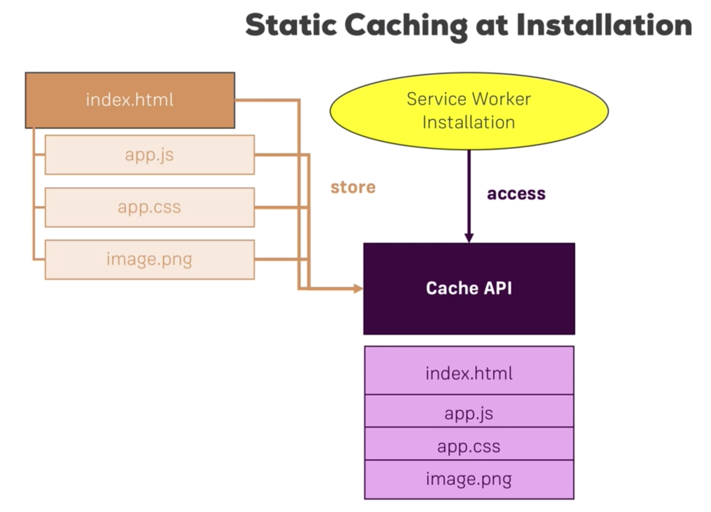

# Table of Contents
- [Core building blocks](#core-building-blocks)
- [PWAs vs SPAs](pwas-vs-spas)
- [Understanding the app manifest](#understanding-the-app-manifest)
  - [Using app manifest to make the application installable](#using-app-manifest-to-make-the-application-installable)
  - [Understanding the app manifest properties](#manifest-properties)
  - [Low support browsers](#low-support-browsers)
    - [Adding properties for safari](#adding-properties-for-safari)
    - [Adding properties for internet explorer](#adding-properties-for-internet-explorer)
- [Service Workers](#service-workers)
  - [Service worker events](#service-worker-events)
  - [Service worker lifecycle](#service-worker-lifecycle)
  - [Registering a service worker](#registering-a-service-worker)
    - [Minimum registration steps](#minimum-registration-steps)
  - [Non-lifecycle event listeners](#non-lifecycle-event-listeners)
- [Getting the app install banner](#getting-the-app-install-banner)
- [Caching](#caching)
  - [Understanding the cache API](#understanding-the-cache-api)
  - [Using the service worker for caching](#using-the-service-worker-for-caching)
    - [Pre-caching the app shell](#pre-caching-the-app-shell)

# Core building blocks
These are the main building blocks used when creating progressive web apps.
- Service workers - JavaScript running in a background process. They allow us to achieve;
  - caching to get offline access
  - background data sync
  - web push notifications
  - other PWA features
- Application manifest - allow addition to the Homescreen
- Responsive design
- Geolocation API
- Media API - access to device camera and audio

# PWAs vs SPAs
SPAs are not necessarily PWAs but they can be turned into PWAs and vice versa.

# Understanding the app manifest
This is a file we add to the application, in the root web folder, that makes the application installable and gets added to the homescreen of the device.

## Using app manifest to make the application installable
Advantage: by getting the application on the homescreen we are able to improve user engagement.

We add the `manifest.json` file in the root web folder. To make it usable, we add a new `link` tag in our html pages, `<link href="/manifest.json />"`, in the header section.

## Manifest properties
- `name` - this refers to the application's name and is displayed places where the browser needs to display an identity name for the application such as the splash screen
- `short_name` - the short name for the app shown below the app icon
- `start_url` - which page should be loaded when we tap the app icon
- `scope` - which pages are included in the PWA experience. A `.` value means all
- `display` - how should the app actually load once it is loaded to the homescreen. `standalone` means it loads without the browser controls
- `background_color` - background whilst loading and on splash screen. Pass the hexadecimal value of a color
- `theme_color` - theme color e.g. on the taskbar in the task switcher
- `description` - the description e.g. when saved as a favourite
- `dir` - the read **direction** of the app e.g. `ltr` for left-to-right
- `lang` - main language of the application e.g. `en_US`
- `orientation` - in which orientation to open the application e.g. `portrait-primary`
- `icons` - configure a set of icons for the browser to display on various places e.g. in the splash screen. It is an array of `json` objects that include:
  - `src` - the icon path
  - `type` - image type e.g. `image/png`
  - `sizes` - the size of the icon. It is good to have at least a `48x48`. They can go all the way to `512x512`
- `related_applications` - Other **native** applications that the user may be interested in installing. It is an array of `json` objects that include:
  - `platform` - e.g. 'play'
  - `url` - target app url
  - `id` - target app id

## Low support browsers
The `manifest.json` file currently has limited support. There are ways to achieve a number of features that the file helps with for other browsers too.

### Adding properties for safari
In Safari (`webkit`), we can add a number of tags as follows;
- `<meta name="apple-mobile-web-app-capable" content="yes" />` - instruct Safari that the application should be treated as a Web app
- `<meta name="apple-mobile-web-app-status-bar-style" content="black" />` - status bar color or use `theme-color` meta tag name
- `<meta name="apple-mobile-web-app-status-bar-style" content="black" />` - app title
- `<link rel="apple-touch-icon" href="/src/to/icon" sizes="144x144"/>` - icon sources

### Adding properties for internet explorer
- `<meta name="msapplication-TileImage" content="src/to/image" />` - icon
- `<meta name="msapplication-TileColor" content="src/to/image" />` - color behind the icon
- `<meta name="theme-color" content="#fff" />` - status bar color. It's also a good fallback for chrome too

# Service Workers
Service workers allow us to develop amazing offline experiences, background data synchronisation and push notifications.

Service workers are background process that are started when the application starts but they keep running even when the browser pages have been closed.

They are also event listeners and they react to certain events.

Service workers require `https` with an exception of `localhost`.

## Service worker events

| Event | Source |
|:------------|:----------------|
|Fetch                       | Browser or page-related JavaScript initiates a fetch request. IMPORTANT: this event is not triggered by `XMLHttpRequest`s and any packages that build on that like `axios`|
| Push notifications | Service worker receives web push notifications from the server. We should do this in the service workers and not in usual page(s) JavaScript because service workers will run in the background even when the page(s) have been closed |
| Notifications interactions | When users interact with the notifications |
| Background synchronisation | Service workers receive background sync events e.g. internet connection was restored |
| Service worker lifecycle   | Service worker phase changes |

## Service worker lifecycle
- Step 1: The `html` page loads its JavaScript file.
- Step 2: The JavaScript loaded in the `html` **registers** the service worker e.g. `serviceWorker.js`
- Step 3: The service worker gets installed and emits the `install` event
- Step 4: The service worker gets activated and emits the `activate` event
- Step 5: Enters idle mode listening to events
- Step 6: After sometime of idling the service worker terminates and goes into sleep mode; it will be woken up as soon as events start coming in and it can also be woken up manually
- Step 7: if a fetch request is triggered either by `html` or JavaScript code, the service worker is triggered and the `fetch` event is emitted

## Registering a service worker
The service worker applies to(scope) the files in the directory in which it sits(recursively). It is common to put it in the root web folder.

We could register the service worker in every html file by loading it with `script` tags but that may not be a very good approach.

The best place to register the service worker is in the root JavaScript file e.g. `index.js` or `app.js`.

### Minimum registration steps
- Check if the service worker feature is supported by the browser using the JavaScript global `navigator` object
 ```js
 if('serviceWorker' in navigator) {
   // register
   navigator.serviceWorker
    .register('/serviceWorker.js', /* optional second arg */{ scope: '/' })
    .then(() => console.log('Service worker registered'));
 }
 ```
- Add event listeners. By referring to the serviceWorker with the `self` keyword in the service worker file, we register events that the service worker should listen to e.g.
  ```js
  self.addEventListener('install', event => (
    console.log('Installing service worker...', event)
  ));
  ```
### Non-lifecycle event listeners
#### Fetch
The fetch event will get triggered during events such as
- The pages fetch JavaScript, CSS files and image assets
- When a fetch request is called in JavaScript to fetch resources from an API

Some key elements in the fetch event object;
- `e.respondWith` - As the service worker sits as a proxy between the client and the server, it may use this method to intercept the request and generate custom responses.
  ```js
  self.addEventListener('fetch', event => {
    event.respondWith(fetch(event.request)); // does nothing useful here but to just resend the fetch request
  })
  ```


## Getting the app install banner
After the service worker has been installed and we have the `manifest.json` file, we have fulfilled the requirements for getting the app install banner for Google Chrome and the client will get this pop up once they interact with the application at least twice with at least 5 minutes between each visit.

### Deferring the install banner
We may desire to have this banner shown only when certain custom criteria is fulfilled as opposed to the minimum requirements above. With that, we can listen to the banner's event `beforeinstallprompt`.

This being a browser event, we add it to the main JavaScript file on the `window` object.

```js
window.addEventListener('beforeinstallprompt', event => {
  event.preventDefault();
  // some code to customise when to show the banner
})
```

## Caching
Caching is a key element to providing offline support for our application. This is important for cases where there is either no connection or there is poor connection, or in `Lie-Fie`.

### Understanding the cache API
This involves a separate cache storage that lives in the browser but is managed by the developer.

The cache maintains key-value pairs where usually the key is the request and the value is the response. The response ought to have been received at least once successfully so that it can be cached.

The cache API can be accessed both in the service workers and also in ordinary JavaScript but they are benefits to both.

The cached data can be retrieved instead of sending the request across the network.


### Using the service worker for caching
Cacheable items constitute the application shell. These can include the toolbar, the sidebar, the footer. Loaded styling and JavaScript files and images in the `` tag are also cacheable items and also some full pages of the application. Static pages are fully cacheable.

#### Pre-caching the app shell

