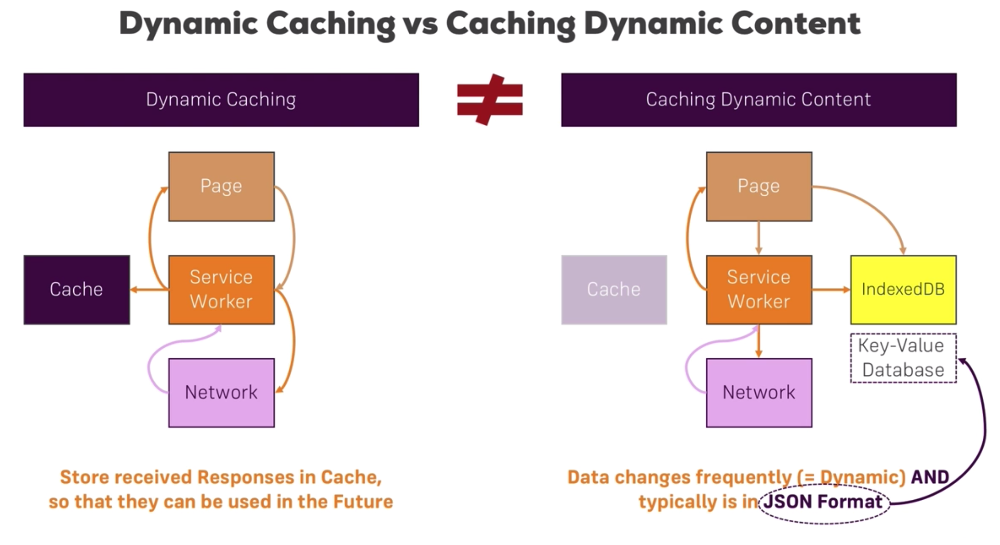
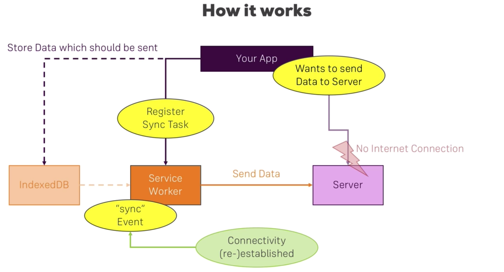

# Table of Contents
- [Core building blocks](#core-building-blocks)
- [PWAs vs SPAs](pwas-vs-spas)
- [Understanding the app manifest](#understanding-the-app-manifest)
  - [Using app manifest to make the application installable](#using-app-manifest-to-make-the-application-installable)
  - [Understanding the app manifest properties](#manifest-properties)
  - [Low support browsers](#low-support-browsers)
    - [Adding properties for safari](#adding-properties-for-safari)
    - [Adding properties for internet explorer](#adding-properties-for-internet-explorer)
- [Service Workers](#service-workers)
  - [Service worker events](#service-worker-events)
  - [Service worker lifecycle](#service-worker-lifecycle)
  - [Registering a service worker](#registering-a-service-worker)
    - [Minimum registration steps](#minimum-registration-steps)
  - [Non-lifecycle event listeners](#non-lifecycle-event-listeners)
- [Getting the app install banner](#getting-the-app-install-banner)
- [Caching](#caching)
  - [Understanding the cache API](#understanding-the-cache-api)
  - [Using the service worker for caching](#using-the-service-worker-for-caching)
    - [Pre-caching the app shell](#pre-caching-the-app-shell)
    - [Caching multiple files](#caching-multiple-files)
  - [Dynamic caching](#dynamic-caching)
  - [Managing the cache versions](#managing-the-cache-versions)
    - [Cleaning up old caches](#cleaning-up-old-caches)
  - [Advanced caching](#advanced-caching)
    - [Caching on demand](#caching-on-demand)
    - [Providing an offline fallback page](#providing-an-offline-fallback-page)
    - [Illustrating caching with network fallback strategy](#illustrating-caching-with-network-fallback-strategy)
    - [The cache only strategy](#the-cache-only-strategy)
    - [The network only strategy](#the-network-only-strategy)
    - [The network with cache fallback strategy](#the-network-with-cache-fallback-strategy)
    - [The cache then network strategy](#the-cache-then-network-strategy)
      - [Cache then network with offline support](#cache-then-network-with-offline-support)
    - [Cache strategies - Routing](#cache-strategies---routing)
    - [Placeholder files for offline support](#placeholder-files-for-offline-support)
- [The IndexedDB](#the-indexeddb)
  - [Caching dynamic content](#caching-dynamic-content)
  - [Introducing the IndexedDB](#introducing-the-indexeddb)
  - [Wrapping the IndexedDB with idb](#wrapping-the-indexeddb-with-idb)
  - [Storing the data in IndexedDB](#storing-the-data-in-indexeddb)
  - [Retrieving data from the IndexedDB](#retrieving-data-from-the-indexeddb)
  - [Removing data from the IndexedDB](#removing-data-from-the-indexeddb)
- [Background sync](#background-sync)
  - [How it works](#how-it-works)
  - [Registering the sync manager](#registering-the-sync-manager)
  - [Storing the post data in IndexedDB](#storing-the-post-data-in-indexeddb)
  - [Adding syncing in the service worker](#adding-syncing-in-the-service-worker)
- [Web push notifications](#web-push-notifications)
  - [How push notifications work](#how-push-notifications-work)

# Core building blocks
These are the main building blocks used when creating progressive web apps.
- Service workers - JavaScript running in a background process. They allow us to achieve;
  - caching to get offline access
  - background data sync
  - web push notifications
  - other PWA features
- Application manifest - allow addition to the Homescreen
- Responsive design
- Geolocation API
- Media API - access to device camera and audio

# PWAs vs SPAs
SPAs are not necessarily PWAs but they can be turned into PWAs and vice versa.

# Understanding the app manifest
This is a file we add to the application, in the root web folder, that makes the application installable and gets added to the homescreen of the device.

## Using app manifest to make the application installable
Advantage: by getting the application on the homescreen we are able to improve user engagement.

We add the `manifest.json` file in the root web folder. To make it usable, we add a new `link` tag in our html pages, `<link href="/manifest.json />"`, in the header section.

## Manifest properties
- `name` - this refers to the application's name and is displayed places where the browser needs to display an identity name for the application such as the splash screen
- `short_name` - the short name for the app shown below the app icon
- `start_url` - which page should be loaded when we tap the app icon
- `scope` - which pages are included in the PWA experience. A `.` value means all
- `display` - how should the app actually load once it is loaded to the homescreen. `standalone` means it loads without the browser controls
- `background_color` - background whilst loading and on splash screen. Pass the hexadecimal value of a color
- `theme_color` - theme color e.g. on the taskbar in the task switcher
- `description` - the description e.g. when saved as a favourite
- `dir` - the read **direction** of the app e.g. `ltr` for left-to-right
- `lang` - main language of the application e.g. `en_US`
- `orientation` - in which orientation to open the application e.g. `portrait-primary`
- `icons` - configure a set of icons for the browser to display on various places e.g. in the splash screen. It is an array of `json` objects that include:
  - `src` - the icon path
  - `type` - image type e.g. `image/png`
  - `sizes` - the size of the icon. It is good to have at least a `48x48`. They can go all the way to `512x512`
- `related_applications` - Other **native** applications that the user may be interested in installing. It is an array of `json` objects that include:
  - `platform` - e.g. 'play'
  - `url` - target app url
  - `id` - target app id

## Low support browsers
The `manifest.json` file currently has limited support. There are ways to achieve a number of features that the file helps with for other browsers too.

### Adding properties for safari
In Safari (`webkit`), we can add a number of tags as follows;
- `<meta name="apple-mobile-web-app-capable" content="yes" />` - instruct Safari that the application should be treated as a Web app
- `<meta name="apple-mobile-web-app-status-bar-style" content="black" />` - status bar color or use `theme-color` meta tag name
- `<meta name="apple-mobile-web-app-status-bar-style" content="black" />` - app title
- `<link rel="apple-touch-icon" href="/src/to/icon" sizes="144x144"/>` - icon sources

### Adding properties for internet explorer
- `<meta name="msapplication-TileImage" content="src/to/image" />` - icon
- `<meta name="msapplication-TileColor" content="src/to/image" />` - color behind the icon
- `<meta name="theme-color" content="#fff" />` - status bar color. It's also a good fallback for chrome too

# Service Workers
Service workers allow us to develop amazing offline experiences, background data synchronisation and push notifications.

Service workers are background process that are started when the application starts but they keep running even when the browser pages have been closed.

They are also event listeners and they react to certain events.

Service workers require `https` with an exception of `localhost`.

## Service worker events

| Event | Source |
|:------------|:----------------|
|Fetch                       | Browser or page-related JavaScript initiates a fetch request. IMPORTANT: this event is not triggered by `XMLHttpRequest`s and any packages that build on that like `axios`|
| Push notifications | Service worker receives web push notifications from the server. We should do this in the service workers and not in usual page(s) JavaScript because service workers will run in the background even when the page(s) have been closed |
| Notifications interactions | When users interact with the notifications |
| Background synchronisation | Service workers receive background sync events e.g. internet connection was restored |
| Service worker lifecycle   | Service worker phase changes |

## Service worker lifecycle
- Step 1: The `html` page loads its JavaScript file.
- Step 2: The JavaScript loaded in the `html` **registers** the service worker e.g. `serviceWorker.js`
- Step 3: The service worker gets installed and emits the `install` event
- Step 4: The service worker gets activated and emits the `activate` event
- Step 5: Enters idle mode listening to events
- Step 6: After sometime of idling the service worker terminates and goes into sleep mode; it will be woken up as soon as events start coming in and it can also be woken up manually
- Step 7: if a fetch request is triggered either by `html` or JavaScript code, the service worker is triggered and the `fetch` event is emitted

## Registering a service worker
The service worker applies to(scope) the files in the directory in which it sits(recursively). It is common to put it in the root web folder.

We could register the service worker in every html file by loading it with `script` tags but that may not be a very good approach.

The best place to register the service worker is in the root JavaScript file e.g. `index.js` or `app.js`.

### Minimum registration steps
- Check if the service worker feature is supported by the browser using the JavaScript global `navigator` object
 ```js
 if('serviceWorker' in navigator) {
   // register
   navigator.serviceWorker
    .register('/serviceWorker.js', /* optional second arg */{ scope: '/' })
    .then(() => console.log('Service worker registered'));
 }
 ```
- Add event listeners. By referring to the serviceWorker with the `self` keyword in the service worker file, we register events that the service worker should listen to e.g.
  ```js
  self.addEventListener('install', event => (
    console.log('Installing service worker...', event)
  ));
  ```
### Non-lifecycle event listeners
#### Fetch
The fetch event will get triggered during events such as
- The pages fetch JavaScript, CSS files and image assets
- When a fetch request is called in JavaScript to fetch resources from an API

Some key elements in the fetch event object;
- `e.respondWith` - As the service worker sits as a proxy between the client and the server, it may use this method to intercept the request and generate custom responses.
  ```js
  self.addEventListener('fetch', event => {
    event.respondWith(fetch(event.request)); // does nothing useful here but to just resend the fetch request
  })
  ```


## Getting the app install banner
After the service worker has been installed and we have the `manifest.json` file, we have fulfilled the requirements for getting the app install banner for Google Chrome and the client will get this pop up once they interact with the application at least twice with at least 5 minutes between each visit.

### Deferring the install banner
We may desire to have this banner shown only when certain custom criteria is fulfilled as opposed to the minimum requirements above. With that, we can listen to the banner's event `beforeinstallprompt`.

This being a browser event, we add it to the main JavaScript file on the `window` object.

```js
window.addEventListener('beforeinstallprompt', event => {
  event.preventDefault();
  // some code to customise when to show the banner
})
```

## Caching
Caching is a key element to providing offline support for our application. This is important for cases where there is either no connection or there is poor connection, or in `Lie-Fie`.

### Understanding the cache API
This involves a separate cache storage that lives in the browser but is managed by the developer.

The cache maintains key-value pairs where usually the key is the request and the value is the response. The response ought to have been received at least once successfully so that it can be cached.

The cache API can be accessed both in the service workers and also in ordinary JavaScript but they are benefits to both.

The cached data can be retrieved instead of sending the request across the network.


### Using the service worker for caching
Cacheable items constitute the application shell. These can include the toolbar, the sidebar, the footer. Loaded styling and JavaScript files and images in the `` tag are also cacheable items and also some full pages of the application. Static pages are fully cacheable.

#### Pre-caching the app shell

*[img] The static files caching flow*


We do this by accessing the cache API in the installation stage of the service worker and there we can open a cache by it's identity.

```js
self.addEventListener('install', event => {
  const preCache = async () => {
    const cache = await caches.open('static-files'); // opens if exists or creates if not
    await cache.add('path/to/the/static/file')
  }

  return event.waitUntil(preCache());
})
```

To retrieve the cached asset from the cache, we add that to the `fetch` event listener of the service worker.

```js
self.addEventListener('fetch', event => {
  const getResponse = async () => {
    const { request } = event;
    const response = await caches.match(request);
    return (response && response) || fetch(request);
  };

  return event.respondWith(getResponse());
})
```

#### Caching multiple files
##### Caching the homepage
The homepage is usually loaded at the index route i.e. `localhost:<port>/` and usually fetches the `index.html`. With that in mind, to cache the homepage, we should cache both requests;

```js
// ...
cache.add('/');
cache.add('/index.html');
// we'll see how to add multiple files to the cache below
```
##### Using cache addAll
This is used to cache multiple files as follows;

```js
self.addEventListener('install', event => {
  const preCache = async () => {
    const cache = await caches.open('static-files'); // opens if exists or creates if not
    await cache.addAll([
      '/' // important to remember to cache index route as this is what initiates the loading of the application
      '/index.html',
      '/src/js/app.js',
      '/src/js/feed.js'
    ]);
  }

  return event.waitUntil(preCache());
})
```

#### Dynamic caching
Some assets are only available to us once a request has already been sent out to fetch them and it has responded successfully. We may want to cache some of these assets the moment they have been available; this would mean that precaching at service worker installation may not work for such circumstances. Caching such assets can be achieved with dyanamic caching;


*[img: Courtesy of Academind] The basic flow of dynamic caching*

##### Implemeting dynamic caching

```js
// ...
self.addEventListener('fetch', event => {
  const getResponse = async () => {
    const { request } = event;
    const cachedResponse = await caches.match(request);
    let response = cachedResponse;
    if (!response) {
      response = await fetch(request);
      const cache = await caches.open('dynamic');
      await cache.put(request.url, response.clone());
    }
    return response;
  };
  event.respondWith(getResponse());
});
```

### Managing the cache versions
The service worker is usually updated when changes occur in the service worker file. But when we make changes to cached static files, these are not usually updated immediately; a crude way to trigger the update of the caches is by making a tiny change in the service worker file to necessitate an update of the service worker and therefore an update of the caches. A more appropriate approach would be to manage cache versions. We do this by updating the version number of the cache to open;

```js
// ...
caches.open('static-files-v2');
```
However, effecting that change alone in the service worker won't work if the service worker is not cleaning up the old cache version. This is because as we try to match the request from the caches, chances are that we're going to get the cached response from the old cache version which does not include our changes in the cached file.

#### Cleaning up old caches
Cleaning up old caches is best done in the activation phase of the service worker; once the service worker has been installed and a new version of the cache has been created, the service worker goes into the activation stage and at this point, we can clean up the old preCache. Just before the activation stage of the new service worker, the application, through the old service worker, maybe making use of files that are in the previous cache version; that is why it is more appropriate to do the cache clean up in the activation stage just when the service workers are exchanging the baton.

```js
// ...
const STATIC_CACHE_ID = 'static-v1';
const DYNAMIC_CACHE_ID = 'dynamic-v1';

self.addEventListener('activate', event => {
  // ...
  const preCacheCleanUp = async () => {
    const cacheIds = await caches.keys();
    const removeCacheProms = cacheIds.map(id => {
      if (id !== STATIC_CACHE_ID && id !== DYNAMIC_CACHE_ID){
        console.log('[Service worker] delete cache', id);
        return caches.delete(id);
      }
    });
    return await Promise.all(removeCacheProms);
  };
  event.waitUntil(preCacheCleanUp());
  // ...
})
```

### Advanced caching
#### Caching on demand
Sometimes we may want to cache assets and request responses upon events triggered by the user. If that's the case, then it's important to keep in mind that the cacheAPI is not only available in service worker code, but it is also available in the usual JavaScript code and it can be manipulated upon the occurrence
 of the events. e.g. upon click of a button.

#### Providing an offline fallback page
This is important in order to show a more meaningful message in cases where fetching fails probably due to lack of internet access. We can achieve this by creating a fallback `offline.html` and responding with that in case we catch an error in when fetching. For now, we'll see an example where we'd catch basically all fetch failure, but in future that can be fine-tuned.

```js
// serviceWorker.js
self.addEventListener('install', event => {
  // ...
  // cache static files
  const preCache = async () => {
    console.log('[Service worker] Precaching app.js')
    const cache = await caches.open('STATIC_CACHE_ID');
    await cache.addAll([
      // ...
      '/offline.html',
      // ...
    ]);
  }
  event.waitUntil(preCache());
  // ...
});


self.addEventListener('fetch', event => {
  const getResponse = async () => {
    const { request } = event;
    const cachedResponse = await caches.match(request);
    let response = cachedResponse;
    if (!response) {
      try {
        // try to fetch the request
        response = await fetch(request);
        const cache = await caches.open(DYNAMIC_CACHE_ID);
        await cache.put(request.url, response.clone());
      } catch(err) {
        //  catch all fetch errors; we'll improve later
        cache = await caches.open('STATIC_CACHE_ID');
        response = await cache.match('/offline.html');
      }
    }
    return response;
  };
  event.respondWith(getResponse());
});

```

#### Illustrating caching with network fallback strategy
So far, the strategy that we have been using can be described as 'Cache with network fallback'. The whole idea is to user the service worker as an interceptor of requests and it'll load assets for a request from the cache if they are availabe, otherwise send the request using `fetch` across the network to get a response.


*[img: Courtesy of Academind] Caching with network fallback strategy*

This could result in a few problems especially once we're responding with cached data for requests whose responses keep changing e.g. there's new data available in the response. We'll see the workaround below.

#### The cache only strategy
This would mean blocking every request from accessing the network and try to load every from the cache. This is important for special assets but in general it is not a very appropriate strategy. It can also be useful for static files like CSS and JavaScript files.

```js
self.addEventListener('fetch', event => {
  if(STATIC_FILES.includes(event.request.url)) {
    event.respondWith(caches.match(event.request));
  }
});
```

#### The network only strategy
This is the opposite of the 'cache only strategy'. It implies fetching every request from the network and completely disregarding the cache. Not a very useful strategy as this is the default behaviour without service workers.

#### The network with cache fallback strategy
In this strategy, we'd hit the network first all the time and only if the network path fails, then we'd look into the cache for a response and respond with that.


*[img: Courtesy of Academind] Network with cache fallback strategy*

The disadvantage of this is that we don't take advantage of the quick responses of the cache; imagine a scenario whereby the network is set to timeout after 60sec. That would mean that we wait for 60sec to respond with what has been cached; not very good user experience!


```js
self.addEventListener('fetch', event => {
  const getResponse = async () => {
    let response;
    try {
      response = await fetch(event.request);
      // we can cache the reponse at this point
    } catch (e) {
      response = caches.match(event.request);
    }
    return response;
  }
  event.respondWith(getResponse());
})
```

#### The cache then network strategy
This strategy involves reaching to the cache first for a response and then, if found, respond with that and then proceed to the network to check an update of the response and if found, update the previously served response both in the cache and the display.


*[img: Courtesy of Academind] Cache, then network strategy*

Normal JavaScript starts out by fetching a response directly from the cache and simultaneously, the request is also handled by the service worker to fetch from the network and update the cache and return the fetched data to the page.

```js
// feed.js
// Fetch from network
const url = 'https://httpbin.org/get';
const receivedNetworkResp = false; // ensures not to overwrite a network resp if it's ready before the cached response

fetch(url)
  .then(function(res) {
    return res.json();
  })
  .then(function(data) {
    receivedNetworkResp = true;
    createCard();
  });

// send a standby response from cache
if('caches' in window) {
  const getCachedResponse = async () => {
    const response = await caches.match(url);
    return response.json();
  }
  getCachedResponse()
    .then(data => {
      if(!receivedNetworkResp)
        createCard();
    });
}
```

##### Dynamic caching with this strategy
This is how the service worker listener would look like for this strategy;

```js
// service worker
self.addEventListener('fetch', event => {
  const getResponse = async () => {
    const response = await fetch(event.request);
    const cache = await caches.open(DYNAMIC_CACHE_ID);
    await cache.put(event.request, response.clone());
    return response;
  };

  event.respondWith(getResponse());
});
```

The problem here would be that we now lose the offline support because we're always making a network call and not handling a network failure. We are also facing a second problem if you can have a look at the items stored in the cache, you'd see that we are again caching items that may have already been cached as static files during the installation phase of the service worker. See below for the solutions.

##### Cache then network with offline support
For the offline support solution, we'd parse the url to check if the url needs a "cache then network" and if not, we respond with the "cache with network fallback strategy". Remember this is keeping the "cache first strategy" as in the `feed.js` file above.

```js
// service worker
self.addEventListener('fetch', event => {
  const getAndCacheUrl = 'https://httpbin.org/get';

  const getAndCacheResponse = async () => {
    const response = await fetch(event.request);
    const cache = await caches.open(DYNAMIC_CACHE_ID);
    await cache.put(event.request, response.clone());
    return response;
  };

  const getCacheOrNetworkResponse = async () => {
    const { request } = event;
    const cachedResponse = await caches.match(request);
    let response = cachedResponse;
    if (!response) {
      try {
        // try to fetch the request
        response = await fetch(request);
        const cache = await caches.open(DYNAMIC_CACHE_ID);
        await cache.put(request.url, response.clone());
      } catch(err) {
        //  catch all fetch errors; we'll improve later
        cache = await caches.open('STATIC_CACHE_ID');
        response = await cache.match('/offline.html');
      }
    }
    return response;
  };

  if (event.request.url.includes(getAndCacheUrl)) // fetch and cache the response
    event.respondWith(getAndCacheResponse());
  else // use cache with network fallback
    event.respondWith(getCacheOrNetworkResponse());
});
```

This is ideally routing; i.e. we parse the url in the request and if it fullfils a desired condition, then we prefer to fetch it and cache it, otherwise we prefer to try and respond with the cache and if that fails we fallback to the network.

##### Cache strategies - Routing
It is a common use case to want to check whether the URL caught by the fetch listener matches a certain pattern or meets certain criteria to determine which caching strategy to route the request to in the service worker.

##### Placeholder files for offline support
When fetch request is intercepted while a connection cannot be established, we can return preCached placeholder files e.g. an offline html page, a placeholder avatar for images etc.

```js
// ...
if (!response) {
  try {
    // try to fetch the request
    response = await fetch(request);
    const cache = await caches.open(DYNAMIC_CACHE_ID);
    await cache.put(request.url, response.clone());
  } catch(err) {
    //  catch all fetch errors; we'll improve later
    cache = await caches.open('STATIC_CACHE_ID');

    if (event.request.headers.get('accept').includes('text/html'))
      response = await cache.match('/offline.html');

    if (event.request.headers.get('accept').includes('image/*'))
      response = await cache.match('/avatar.svg');
  }
}
// ...
```

##### Managing the cache size
Often time, we may want to limit the amount of elements cached especially for dynamic caching. On adding an item to the cache, it may be useful to trim the cache to ensure that we are not bursting the desirable limits.

```js
const trimCache = async (cache, limit) => {
  let keys = await cache.keys();
  while(keys.length > limit) {
    await cache.delete(keys[0]);
    keys = await cache.keys();
  }
}
// ...
if (!response) {
  try {
    // try to fetch the request
    response = await fetch(request);
    const cache = await caches.open(DYNAMIC_CACHE_ID);
    // trim the cache
    await trimCache(cache, 10);
    await cache.put(request.url, response.clone());
  }
  // ...
}
```


# The IndexedDB
The cache API is execellent for caching assets e.g. script files, css files, images etc. We can also cache data received from the server but it is best cached in the IndexedDB.

## Caching dynamic content

Caching dynamic content is different from dynamic caching in that while the latter is best for caching assets once they have been fetched, the former is meant for caching data usually data fetched from the server in JSON format(key-value pairs). The IndexedDB is a Key-Value pairs database and hence best suited for caching data of such nature.


*[img: Courtesy of Academind]*

## Introducing the IndexedDB
A few features of the IndexedDB;

- It is a transactional Key-Value pairs database i.e. if one of the operations in a given transaction fails, none of the operations are applied. Everything we do with the IndexedDB has to be transactional
- We could also store a significant amount of data including Files and Blobs
- It can also be accessed asynchronously
- It can also be accessed via usual JavaScript code and also from service workers

The difference with Local Storage and Session Storage is that both of these are read synchronously; hence, they cannot be used in service workers.

## Wrapping the IndexedDB with idb
The IndexedDB uses the callbacks approach. `idb` is a tiny package that wraps the IndexedDB in order to allow us to make use of JavaScript promises when working with the IndexedDB. To use it, we simply need to import it into the application.

To use this in the Service worker, we need to import it. The service workers have the `importScripts` utility that will enable us to import other scripts.

```js
// ...
importScripts('/path/to/idb.js');
// ...
```

It would also be necessary to add the file in the Static cache so that it can be loaded in offline mode as well.

```js
cache.addAll([
  // ...
  '/path/to/idb.js',
  // ...
])
```

## Storing data in the IndexedDB
We need to create a database in order to add tables and data to it. Once idb has been made available to the service worker, we can create the database as follows;

```js
// dbUtilities.js

// pass the preferred name of the database, and, optionally, a version.
dbPromise = idb.open('my-first-idb', 1, (db) => {
  // add a table only if it does not exist
  // keyPath, is a highest level attribute, in the JSON to be stored, that can be used as the primary key.
  if (!db.objectStoreNames.contains('my-first-table')) {
    db.createObjectStore('my-first-table', { keyPath: 'id' });
  }
});
```

We can then add some logic in the `fetch` event listener to cache some data once they're available.

```js
// dbUtilities.js
// ...
function writeData(objectStore, data) {
  const db = await dbPromise; // as created earlier
  // create a transaction in the context of the table with right permissions
  const transaction = db.transaction(objectStore, 'readwrite');
  // open the table through the transaction
  const store = transaction.objectStore(objectStore);
  // store the post as the value; the key is the keyPath attribute in the post i.e. id
  store.put(data);
  return transaction.complete;
}


// serviceWorker.js
// ...
importScripts('/path/to/dbUtilities.js');
// ...

self.addEventListener('fetch', async (event) => {
  const { request } = event;
  // we can add some routing checks to determine how to handle different types of requests e.g.
  const url = 'https://an.endpoint.to/fetch/some/json/data/that/needs/caching';
  let response;
  if (request.url.contains(url)) {
    response = await fetch(request);
    // store the JSON in table in the database
    cloneResp = response.clone();
    const postsProm = await cloneResp.json();
    const posts = await postsProm;
    // add the posts to the table in the database
    posts.forEach(post => {
      writeData('my-first-table', post);
    })
  }
  event.respondWith(response);
});
// ...
```

## Retrieving data from the IndexedDB
The store object provides a function for getting all the data from the objectStore. `store.getAll()`. We can make use of this to retrieve data from the IndexedDB.

```js
// dbUtilities.js
// ...

async function readAllData (objectStore) {
  const db = await dbPromise;
  const transaction = db.transaction(objectStore, 'readonly');
  const store = db.objectStore(objectStore);
  return store.getAll(); // we don't need to return a transaction.complete as  this is a read operation hence the integrity and consistency of the database was not at stake
}

// ....
```

In the posts JavaScript code, we need to make use of the utility above to read data from the IndexedDB if we have not received data from the network.

```js
// fetch data from network and use the cached data if we didn't recieve any
const url = 'https://an.endpoint.to/fetch/some/json/data/that/needs/caching';
const networkDataReceived = false;

try {
  const jsonDataProm = await fetch(url);
  const posts = await jsonDataProm;
  networkDataReceived = true;
  displayPosts(posts);
} catch (err) {
  console.log(err);
}

// load data from IndexedDB
if('indexedDB' in window) {
  if (!networkDataReceived) {
    const posts = await readAllData('my-first-table');
    displayPosts(posts);
  }
}
```

## Removing data from the IndexedDB
In case items are deleted from the network source e.g. an API, the IndexedDB doesn't remove them. This means that if the client is offline and data is loaded from the indexedDB, then they might end up getting items that have already been deleted. It is therefore important that we clear the entries in the indexedDB first before writing into it when network response has been received.

```js
// dbUtilities.js
// ...

async function clearAllData (objectStore) {
  const db = await dbPromise;
  const transaction = db.transaction(objectStore, 'readwrite');
  const store = db.objectStore(objectStore);
  store.clear();
  return transaction.complete; // returns a promise that resolves if everything is ok
}

// ....
```

```js
// serviceWorker.js
// ...
importScripts('/path/to/dbUtilities.js');
// ...

self.addEventListener('fetch', async (event) => {
  const { request } = event;
  // we can add some routing checks to determine how to handle different types of requests e.g.
  const url = 'https://an.endpoint.to/fetch/some/json/data/that/needs/caching';
  let response;
  if (request.url.contains(url)) {
    // fetch the data
    // clear the indexedDB
    await clearAllData('my-first-table');
    // add the posts to the table in the database
    posts.forEach(post => {
      writeData('my-first-table', post);
    })
  }
  event.respondWith(response);
});
// ...
```

### Removing a single item from indexedDB
We can use the `store.delete(<id>)` method to remove a particular entry in the objectStore.


# Background sync
## How it works
Service workers are good for caching request responses. That means that we can cache the responses of POST requests but we can't cache the requests themselves for sending at a later point in time. We, however, can use the service worker to register a synchronous task. We need to then store the data associated with the request in the IndexedDB. Once a connection is re-stablished, the request can be handled by a 'sync' event based on how we have instructed the service worker. This will even work even if the browser got closed.


*[img: Courtesy of Academind]*

## Registering the sync manager
Let us imagine that we have a form that users fill in with data to post. On the submit handler of the form, we can register a sync manager such that incase the user is offline, or they perhaps close the browser immediately on hitting a submit button before the post has completed, they background synchronisation can take up the task of ensuring that the post request will be sent out whenever it's possible.

```js
// feeds.js
const sendViaSyncManager = async () =>  {
  const serviceWorker = await navigator.serviceWorker.ready;
  // choose any name of your liking for the registration identity of the sync manager, e.g. sync-new-post
  const data = {
    input1: 'value1',
    input2: 'value3',
  }
  await writeData('sync-new-post-object-store', data); // see definition of function in earlier notes
  await serviceWorker.sync.register('sync-new-post');
}

const postData = async () => {
  // send via sync manager if browser supports
  if('ServiceWorker' in navigator && 'SyncManager' in window) {
    await sendViaSyncManager();
  } else {
    // send data normally
  }
}

form.addEventListener('submit', event => {
  event.preventDefault();
  // we should do some form validation here
  // register a sync manager, ensuring browser support
  postData();
});
```

The SyncManager API allows us to do the background synchronisation. When registering the SyncManager with the service worker, we can get access to the service worker with `navigator.serviceWorker.ready`. This checks if we have a service worker installed and active and if so, the promise it returns resolves the Service worker. We can then use that to register a sync manager.

We register a task by giving it a name for reference in the service worker e.g. `sync-new-post`. We can use this name to reference the sync task in the service worker to react to a connection re-established event.

## Storing the post data in IndexedDB
The data to be synced needs to be stored somewhere that the service worker can access later once a connection has been established. The indexedDB is the most appropriate bet as discussed earlier. See earlier notes on how to write data to the indexedDB.

## Adding syncing in the service worker
The `sync` event is emitted if there is a connection at the time of registering a sync task, or once a connection has been re-established if it wasn't available. It is fired for each task that has been registered with the sync manager as we have seen the sync manager registration section.

The `event` object for this event contains a tag that is usually the unique identifier passed when registering the sync manager e.g. 'sync-new-post'.

```js
// serviceWorker.js

self.addEventListener('sync', async (event) => {
  switch (event.tag) {
    case 'sync-new-post': // loop through items in the sync-new-post-object-store and sync the server
      event.waitUntil(
        const posts = await readAllData('sync-new-post-object-store');
        posts.forEach(post => {
          const res = await fetch('https://example.com/posts/endpoint', {
            method: 'POST',
            headers: {
              'Content-Type': 'application/json',
              'Accept': 'application/json',
            },
            body: JSON.stringify({
              id: post.id,
              title: post.title,
              location: post.location,
              image: post.image,
            })
          });
          if (res.ok) {
            deleteItemFromDb('sync-new-post-object-store', post.id);
          }
        });
      );
      break;
    default:

  }
});
```

# Web push notifications
Push notifications enable developers to drive user engagement and drive users back into the application. From a user's perspective, you get notified about things that matter to you.

## How push notifications work
- The user enables notifications

$$
\begin{equation}
E=m
\end{equation}
$$
